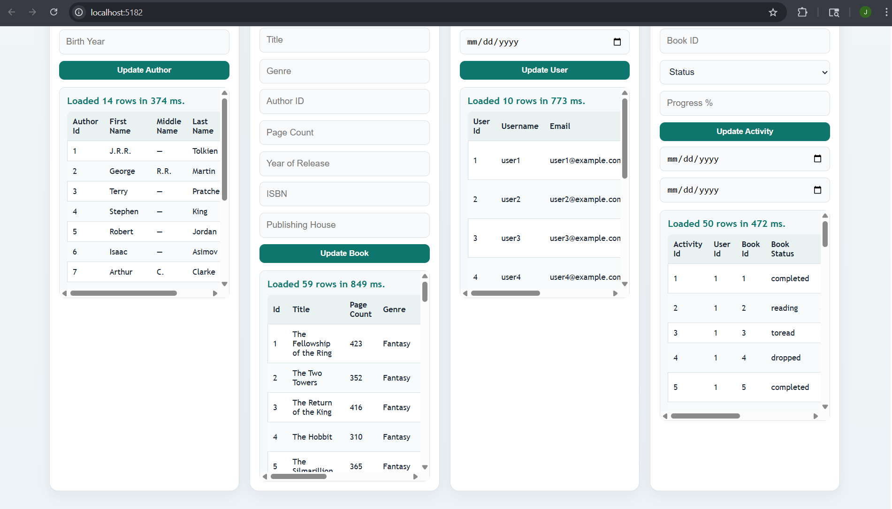
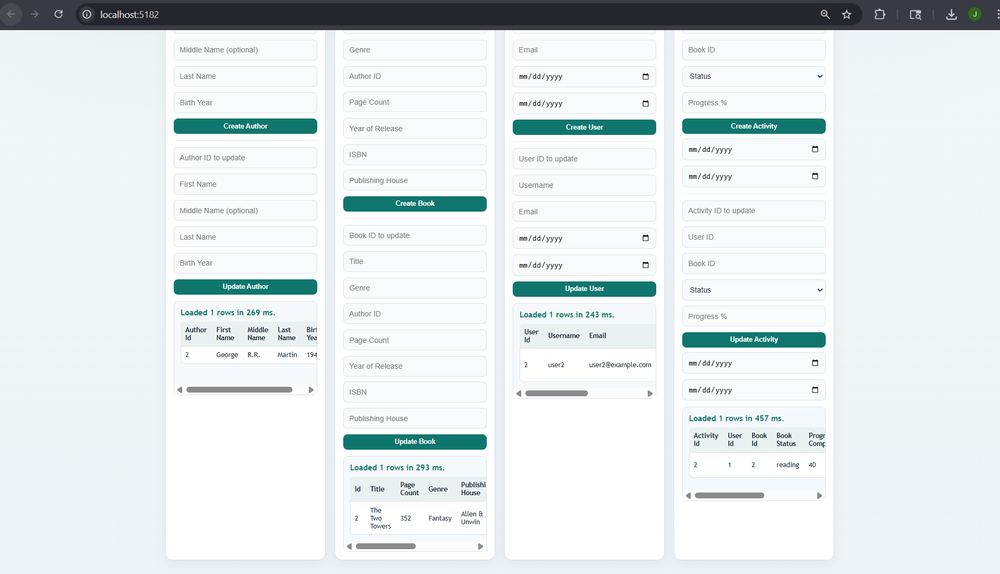
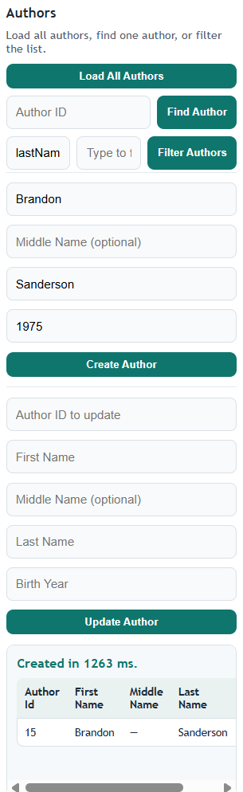
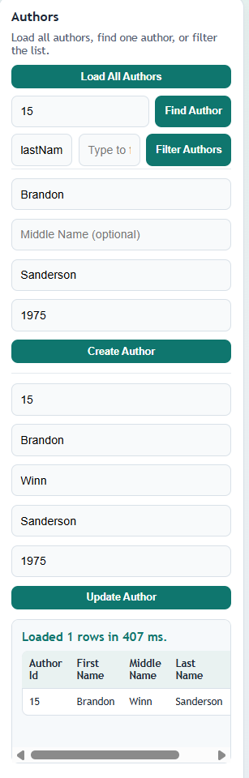

# BookTracker Deployment Guide

This guide walks a new user from "Download ZIP" to a working deployment (local and hosted).

## AI Usage Summary (required, short)
### Prompts used (by layer)
- Front end: add insert/update, make fields user friendly, add delete, increase input sizes, add dividers.
- API: add CORS headers, fix CORS errors, fix build errors.
- Data layer: fix JsonDocument disposal, align enum values.
- Docs: generate deployment doc, update README.

### Changes to AI output
- CORS tightened to avoid `*`, added origin rules + explicit headers.
- Activity status updated to Postgres enum (`toread`).
- Removed OpenAPI package to fix build errors.

### Effectiveness (concise)
- AI sped up UI and docs, but missed enum mismatch and port conflicts.
- Required manual fixes for CORS, build locks, and local port usage.

## Contents
1. Project overview
2. Prerequisites
3. Download and unzip
4. Configure environment
5. Run locally (API + Web client)
6. Host the back end (Render)
7. Host the front end (Vercel)
8. Validate success
9. Troubleshooting
10. AI Usage Summary

## 1. Project overview
This repo contains four components:
- `BookTracker` - Shared business/models/data logic.
- `BookTrackerApi` - ASP.NET Core Web API (service layer).
- `BookTrackerWebClient` - Static HTML/JS web client (frontend).
- `BookTrackerConsoleClient` - Optional console client.

The API talks to Supabase (Postgres) using `SUPABASE_URL` and `SUPABASE_ANON_KEY`.
The web client talks to the API using `WEBCLIENT_API_BASE_URL`.

## 2. Prerequisites
Install the following:
- .NET 8 SDK (required to build/run API and console client).
- Git (optional but recommended for cloning).
- A code editor (VS Code or Visual Studio).
- A Supabase account and project (Postgres).
- A Render account (to host the API).
- A Vercel account (to host the web client).

Optional tools:
- A REST client (Postman, curl) for testing API endpoints.

## 3. Download and unzip
1. Open the GitHub repo page.
2. Click `Code` -> `Download ZIP`.
3. Unzip the archive to a folder, e.g. `C:\Projects\BookTracker`.
4. Open the folder in your code editor.

## 4. Configure environment
You will need three values:
- `SUPABASE_URL`
- `SUPABASE_ANON_KEY`
- `WEBCLIENT_API_BASE_URL` (this will be your Render API URL)

### 4.1 Supabase setup
1. Create a Supabase project.
2. In Supabase, find:
   - Project URL -> `SUPABASE_URL`
   - Anon public key -> `SUPABASE_ANON_KEY`
3. Create the database schema and seed data:
   - Use the SQL files in `BookTracker`:
     - `BookTracker/table_creation_postgres.sql`
     - `BookTracker/data_inserts_postgres.sql`
   - Run them in Supabase SQL Editor (in that order).

### 4.2 Render + Vercel env vars
You will set env vars in the host dashboards:
- Render (API):
  - `SUPABASE_URL`
  - `SUPABASE_ANON_KEY`
  - `ASPNETCORE_ENVIRONMENT=Production`
- Vercel (Web client):
  - `WEBCLIENT_API_BASE_URL=https://<your-render-service>.onrender.com`

## 5. Run locally (API + Web client)

### 5.1 API (local)
1. Open a terminal in the repo root.
2. Set environment variables:
   - PowerShell:
     - `$env:SUPABASE_URL="https://your-project.supabase.co"`
     - `$env:SUPABASE_ANON_KEY="your-anon-key"`
3. Run the API:
   - `dotnet run --project .\BookTrackerApi\BookTrackerApi.csproj`
4. The API will start on `http://localhost:5080` by default.

Verify:
- Visit `http://localhost:5080/` -> should return `BookTracker API is running.`
- Visit `http://localhost:5080/api/ping` -> should return JSON with `status: ok`.

### 5.2 Web client (local)
The web client is static. You can serve it locally in any simple server.

Option A: Use `dotnet` minimal server
1. Set the API base URL in `BookTrackerWebClient/wwwroot/index.html`:
   - Update the `<meta name="webclient-api-base-url" ...>` content to your local API URL.
2. Run:
   - `dotnet run --project .\BookTrackerWebClient\BookTrackerWebClient.csproj`
3. Open the printed URL (usually `http://localhost:5000`).

Option B: Open directly
1. Open `BookTrackerWebClient/wwwroot/index.html` in a browser.
2. Set the API Base URL in the UI.

Verify:
- Click "Load All Authors" and confirm data is shown.

## 6. Host the back end (Render)
The API is already configured for Render with `render.yaml`.

1. Push the repo to GitHub (or import the repo into Render).
2. In Render, create a new Web Service:
   - Choose `Docker` runtime.
   - Root directory: `BookTrackerApi`
   - Render will use `BookTrackerApi/Dockerfile`.
3. Set environment variables:
   - `SUPABASE_URL`
   - `SUPABASE_ANON_KEY`
   - `ASPNETCORE_ENVIRONMENT=Production`
4. Deploy.

Verify:
- Open `https://<your-render-service>.onrender.com/`
- Open `https://<your-render-service>.onrender.com/api/ping`

If you get errors, check Render logs for missing env vars or DB connectivity.

## 7. Host the front end (Vercel)
The web client is static and deployed from `BookTrackerWebClient`.

1. Create a new Vercel project.
2. Set the Root Directory to `BookTrackerWebClient`.
3. Vercel will use `BookTrackerWebClient/vercel.json`.
4. Add environment variable:
   - `WEBCLIENT_API_BASE_URL=https://<your-render-service>.onrender.com`
5. Deploy.

Verify:
- Open your Vercel URL.
- Click "Load All Books" and confirm data appears.

## 8. Validate success
You're done if:
- API root shows the running message.
- `/api/ping` returns JSON with `status: ok`.
- Web client loads data without errors.
- Create and update actions succeed from the UI.

## 9. Troubleshooting
- 404 on Vercel:
  - Ensure Root Directory is `BookTrackerWebClient`.
  - Ensure `BookTrackerWebClient/vercel.json` exists in the deployed path.
- API errors:
  - Check Render environment variables and Supabase keys.
  - Confirm Supabase tables were created with the provided SQL.
- Web client can't reach API:
  - Make sure `WEBCLIENT_API_BASE_URL` is correct.
  - Confirm Render service is running.

# Screenshots:

## GET All Items

## GET Single Items

## Create

## Update

## Delete

## 10. AI Usage Summary (short)
### Prompts used (by layer)
- Front end: add insert/update, make fields user friendly, add delete, increase input sizes, add dividers.
- API: add CORS headers, fix CORS errors, fix build errors.
- Data layer: fix JsonDocument disposal, align enum values.
- Docs: generate deployment doc, update README.

### Changes to AI output
- CORS tightened to avoid `*`, added origin rules + explicit headers.
- Activity status updated to Postgres enum (`toread`).
- Removed OpenAPI package to fix build errors.

### Effectiveness (concise)
- AI sped up UI and docs, but missed enum mismatch and port conflicts.
- Required manual fixes for CORS, build locks, and local port usage.
